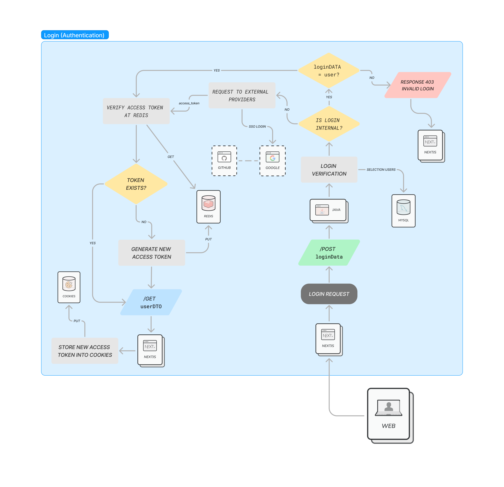

# Budget Buddy

> A simple home finance application to manage and control, yours and your family, budget.

This project aims to create a complete application which manages the income's and spending's flux.

### Authorization and Authentication

## Internal Flow

- [x] Access and refresh tokens creation.
- [x] POST user details persistence into MySQL.
- [x] POST access token persistence into Redis.
- [x] Tokens revalidation and persistence.
- [x] Tokens expire verification.
- [x] POST avatar file blob upload.
- [x] PUT avatar file.
- [x] GET user details.
- [x] GET token verification and validation.
- [ ] GET users connected based between parent and children.

## GitHub Flow

Using GitHub APP installation for the authorization flow, because it's the only way that returns
a refresh_token, when the OAUTH flow implement's it, should be wise to change the provider from APP to OAUTH.

- [ ] Redirect auth URL.
- [ ] Access and refresh tokens creation.
- [ ] User details persistence into MySQL.
- [ ] Access token persistence into Redis.
- [ ] Tokens revalidation and persistence.
- [ ] Tokens expire verification.

## Google Flow

- [ ] Redirect auth URL.
- [ ] Access and refresh tokens creation.
- [ ] User details persistence into MySQL.
- [ ] Access token persistence into Redis.
- [ ] Tokens revalidation and persistence.
- [ ] Tokens expire verification.

### Expenses

- [x] POST new expense.
- [x] PUT expense.
- [x] GET monthly expenses summary.
- [x] GET all expenses.
- [x] Expenses date and type filters.
- [x] Expenses pagination.

### Incomes

- [x] POST new income.
- [x] PUT income.
- [x] GET all incomes.
- [x] Income date and type filters.
- [x] Incomes pagination.
- 
### Balances

- [x] GET balance by period.
- [x] GET balance by date and year.
- [x] GET balance by weeks.

### Login Chart

